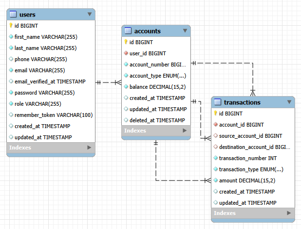

# Bank API

Basic banking API built with Laravel 8 and Laravel Sanctum. It supports user registration, token authentication, account management, deposits, withdrawals, transfers, and transaction history.

## Requirements

- PHP 8.2. The deploy target is pinned to PHP 8.2 because the current Laravel 8 lock file includes dependencies that do not support PHP 8.3+.
- Composer.
- MySQL/MariaDB for local development.
- Common Laravel PHP extensions: `openssl`, `pdo`, `pdo_mysql`, `mbstring`, `tokenizer`, `xml`, `ctype`, `json`, `curl`, `fileinfo`, `zip`, and `bcmath` if available.

Railway uses the root `Dockerfile` to build the service with PHP `8.2.31`, bypassing Railpack PHP auto-detection.
The container starts Laravel with `php artisan serve` on Railway's `$PORT`.
On container startup it also runs `php artisan migrate --force` and `php artisan db:seed --force`; `AdminUserSeeder` is idempotent and creates or updates the admin user from the `ADMIN_*` environment variables.

## Installation

```bash
composer install
copy .env.example .env
php artisan key:generate
```

Configure the database in `.env`:

```env
DB_CONNECTION=mysql
DB_HOST=127.0.0.1
DB_PORT=3306
DB_DATABASE=banco
DB_USERNAME=root
DB_PASSWORD=
```

Create the database with UTF-8 support:

```sql
CREATE DATABASE banco
CHARACTER SET utf8mb4
COLLATE utf8mb4_unicode_ci;
```

Run migrations:

```bash
php artisan migrate
```

Create the admin user from the credentials defined in `.env`:

```env
ADMIN_FIRST_NAME=System
ADMIN_LAST_NAME=Admin
ADMIN_PHONE=
ADMIN_EMAIL=admin@example.com
ADMIN_PASSWORD=change-this-password
```

`ADMIN_EMAIL` and `ADMIN_PASSWORD` are required when running the database seeder. Use a strong password and do not commit real production credentials.

Then run:

```bash
php artisan db:seed
```

If you already have a test database with an old schema, reset it with:

```bash
php artisan migrate:fresh
php artisan db:seed
```

## Running The Project

Start the Laravel development server:

```bash
php artisan serve
```

The API will be available at:

```text
http://127.0.0.1:8000/api
```

If you use Laragon, you can also open the local host generated by Laragon and consume endpoints under `/api`.

## Swagger / Interactive Documentation

The API documentation is available from the project root:

```text
http://127.0.0.1:8000/
```

Swagger UI is also available at:

```text
http://127.0.0.1:8000/api-docs
```

The project includes the static OpenAPI specification at:

```text
public/docs/openapi.json
```

The Swagger page loads Swagger UI from a CDN. If you do not have internet access, the OpenAPI JSON is still available at `/docs/openapi.json`.

Use the interactive documentation for endpoint details, request examples, authentication requirements, and response schemas.

## UML / Database Diagram

It can then be viewed in the browser at:

```text
http://127.0.0.1:8000/docs/database-uml.png
```



## Implemented Rules

- Banking routes are protected with `auth:sanctum`.
- User management routes require an admin user.
- Personal Sanctum tokens are used for API clients.
- Users have a `role` field: `customer` or `admin`.
- Balances and amounts use `decimal(15, 2)` in the database.
- Money operations run inside `DB::transaction()`.
- Account rows are locked with `lockForUpdate()` before balance changes.
- Account ownership is validated before deposits, withdrawals, and transfers.
- Withdrawals and transfers reject insufficient balance.
- Transactions cannot be updated or deleted through the API.

## Tests

Tests use in-memory SQLite configured in `phpunit.xml`.

```bash
php artisan test
```

Current coverage:

- Registration, account creation, and token generation.
- Protected routes require authentication.
- Admin-only routes reject customer users.
- Admin users can manage customer users.
- Authenticated profile update.
- Deposit, withdrawal, transfer, and transaction history.
- Users cannot operate another user's account.
- Withdrawals reject insufficient balance.

## Security Notes

This version is a functional base, not a production-ready banking platform. A production banking system would still need full audit trails, operational limits, idempotency keys, fraud checks, alerts, KYC, sensitive data encryption, monitoring, role policies, infrastructure hardening, backups, and compliance review.
